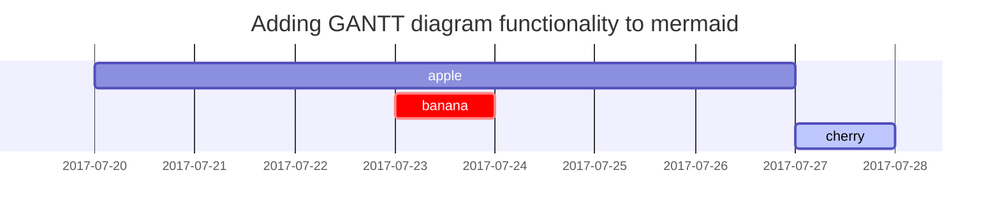

重新整理了下个人 github pages 上的文档，并换了个主题。


## Jekyll

Jekyll 是个静态站点生成器，主要用来把 markdown 写的文档按照主题里的配置转化为 html，然后再根据自己的需要部署到 web server 或者 github 上。

[Jekyll Docs](https://jekyllrb.com/docs/) 总共也不长，通读一遍花不了多久，对有些比较方便的功能做下记录。


### Front Matter

[Front Matter](https://jekyllrb.com/docs/front-matter/) 是格式为 yaml 的一段代码，任何包含 front matter 的文件都会被 jekyll 处理。譬如，下边这段 front matter 指明文档布局为 post，文档名为 Blogging Like a Hacker。

```yaml
---
layout: post
title: Blogging Like a Hacker
---
```

一些预定义的全局变量如下：

| 变量        | 描述                                                     |
| ----------- | -------------------------------------------------------- |
| `layout`    | 文档布局，一般的 theme 中有 post 和 page 两种。          |
| `permalink` | 文档布署后的链接 （默认 `/year/month/day/title.html`）。 |
| `published` | false 表示不发表。                                       |

一些预定义的 post 变量如下：

| 变量                  | 描述                                                         |
| --------------------- | ------------------------------------------------------------ |
| `date`                | 用于覆盖 post 名称中的日期。                                 |
| `category categories` | 文档所属类别，写法为 yaml list 的写法，或者用空格分隔也可以。 |
| `tags`                | 文档标签，同上为 yaml list，或用空格分隔。                   |

[Front Matter Defaults](https://jekyllrb.com/docs/configuration/front-matter-defaults/) 是写在 _config.yml 中的全局配置，用来避免一些不必要的重覆配置。譬如，我所有的文档都是 post 布局，没必要在每个 post 里都写上 `layout: post`，写在 _config.yml 即可。下边是一个例子：所有路径下的 posts 都使用 post 布局，projects 路径下的 pages 使用 project 布局并指定 author 为 Mr. Hyde。

```yaml
defaults:
  -
    scope:
      path: ""
      type: "posts"
    values:
      layout: "post"
  -
    scope:
      path: "projects"
      type: "pages"
    values:
      layout: "project"
      author: "Mr. Hyde"
```


### Pages

你可以使用 markdown 文件书写 page 的内容，.md 最后会被转化为 .html。如下，在工程的根目录下添加 about.md，它最后就会被生成为 about.html。

```
.
├── about.md    # => http://example.com/about.html
├── index.html    # => http://example.com/
└── contact.html  # => http://example.com/contact.html
```

如果 page 比较多，则可以通过添加目录加以区分，添加的目录也会体现在最终的 url 中：

```
.
├── about.md          # => http://example.com/about.html
├── documentation     # folder containing pages
│   └── doc1.md       # => http://example.com/documentation/doc1.html
├── design            # folder containing pages
│   └── draft.md      # => http://example.com/design/draft.html
```


### Posts

文档通常存放在 _posts 目录下，插入图片或者文件需要以工程的根目录为相对路径：

```markdown

... you can [get the PDF](/assets/mydoc.pdf) directly.
```

文档的类别 categories 可以通过目录来控制，任何处于 _posts 目录之上的目录都会被当做 categories，如下文档会自动被添加类别：movies 和 horror。

```text
movies/horror/_posts/2019-05-21-bride-of-chucky.markdown
```


## Chirpy

[jekyll-theme-chirpy](https://github.com/cotes2020/jekyll-theme-chirpy/) 是偶然发现的一个主题，功能丰富，比较中意。[chirpy-starter](https://github.com/cotes2020/chirpy-starter) 是作者提供的开箱即用的方法，我也写了一个目录更少的 **[chirpy-simple-starter](https://github.com/chaiyan0216/chirpy-simple-starter)**。

这是它的 demo，同时也是说明文档：[Chirpy](https://chirpy.cotes.info)。


### 写法

常规的就不写了，列几个其它 theme 没有或者转换的不太好的写法。

#### Todo List

- [x] Completed
- [ ] Defeat COVID-19
  - [x] Vaccine production
  - [ ] Economic recovery

#### Description list

Sun
: the star around which the earth orbits

Moon
: the natural satellite of the earth, visible by reflected light from the sun

#### Footnote

Click the hook will locate the footnote[^footnote], and here is another footnote[^fn-nth-2].

#### Float Image

- Float to left

  {: width="972" height="589" style="max-width: 200px" .left}
  "A repetitive and meaningless text is used to fill the space. A repetitive and meaningless text is used to fill the space. A repetitive and meaningless text is used to fill the space. A repetitive and meaningless text is used to fill the space. A repetitive and meaningless text is used to fill the space. A repetitive and meaningless text is used to fill the space. A repetitive and meaningless text is used to fill the space. A repetitive and meaningless text is used to fill the space. A repetitive and meaningless text is used to fill the space. A repetitive and meaningless text is used to fill the space. A repetitive and meaningless text is used to fill the space. A repetitive and meaningless text is used to fill the space."

- Float to right

  {: width="972" height="589" style="max-width: 200px" .right}
  "A repetitive and meaningless text is used to fill the space. A repetitive and meaningless text is used to fill the space. A repetitive and meaningless text is used to fill the space. A repetitive and meaningless text is used to fill the space. A repetitive and meaningless text is used to fill the space. A repetitive and meaningless text is used to fill the space. A repetitive and meaningless text is used to fill the space. A repetitive and meaningless text is used to fill the space. A repetitive and meaningless text is used to fill the space. A repetitive and meaningless text is used to fill the space. A repetitive and meaningless text is used to fill the space. A repetitive and meaningless text is used to fill the space."

#### Mermaid SVG



#### Mathematics

Powered by [**MathJax**](https://www.mathjax.org/):

$$ \sum_{n=1}^\infty 1/n^2 = \frac{\pi^2}{6} $$

When $a \ne 0$, there are two solutions to $ax^2 + bx + c = 0$ and they are

$$ x = {-b \pm \sqrt{b^2-4ac} \over 2a} $$


[^footnote]: The footnote source
[^fn-nth-2]: The 2nd footnote source


### 配置

在 _config.yml 中控制以下功能的全局开关，或者在每个 post 的 front matter 处单独控制。

#### TOC

```yaml
# 默认打开
---
toc: false
---
```

#### Comments

```yaml
# 默认关闭
---
comments: true
---
```

#### Mathematics

```yaml
# 默认关闭
---
math: true
---
```

#### [Mermaid](https://github.com/mermaid-js/mermaid)

```yaml
# 默认关闭
---
mermaid: true
---
```

#### Pinned Posts

```yaml
---
pin: true
---
```

#### Line Number

~~~markdown
```shell
echo 'No more line numbers!'
```
# 关闭 lineno
{: .nolineno}
~~~

#### Specifying the Filename

````markdown
```shell
# content
```
# 通过文件路径引入 code block
{: file="path/to/file" }
````


